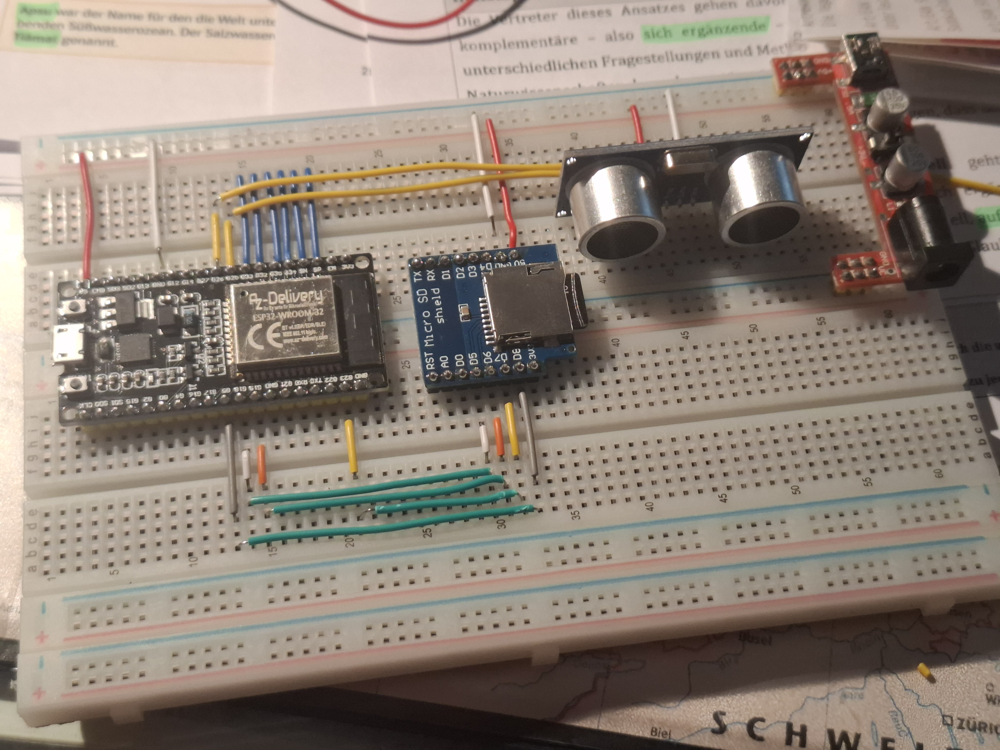
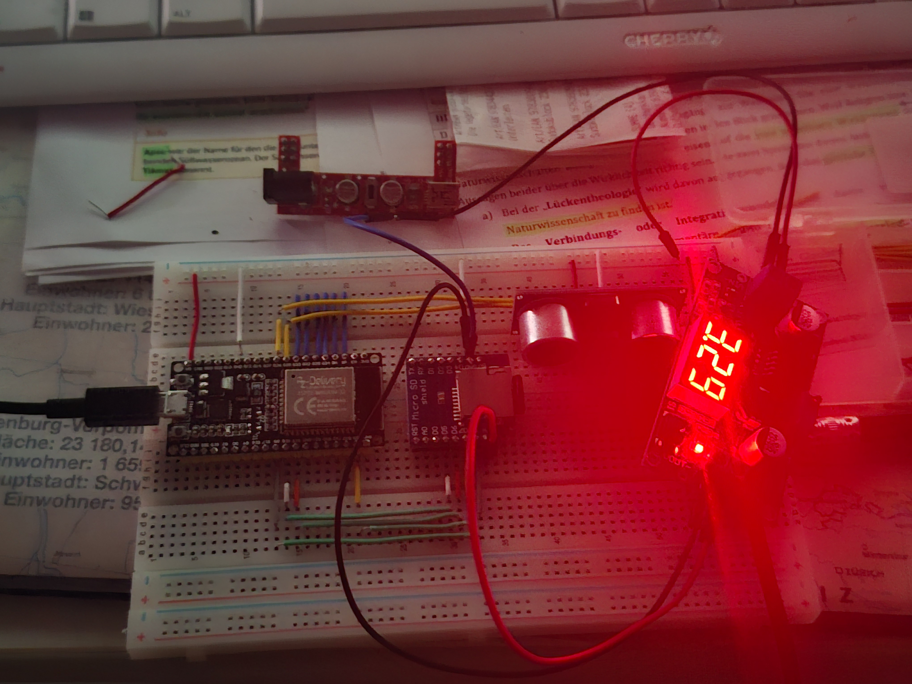
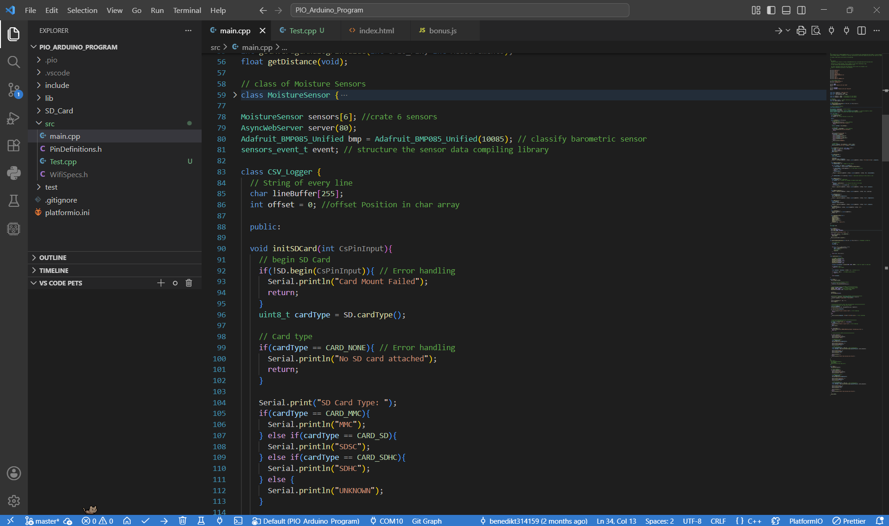
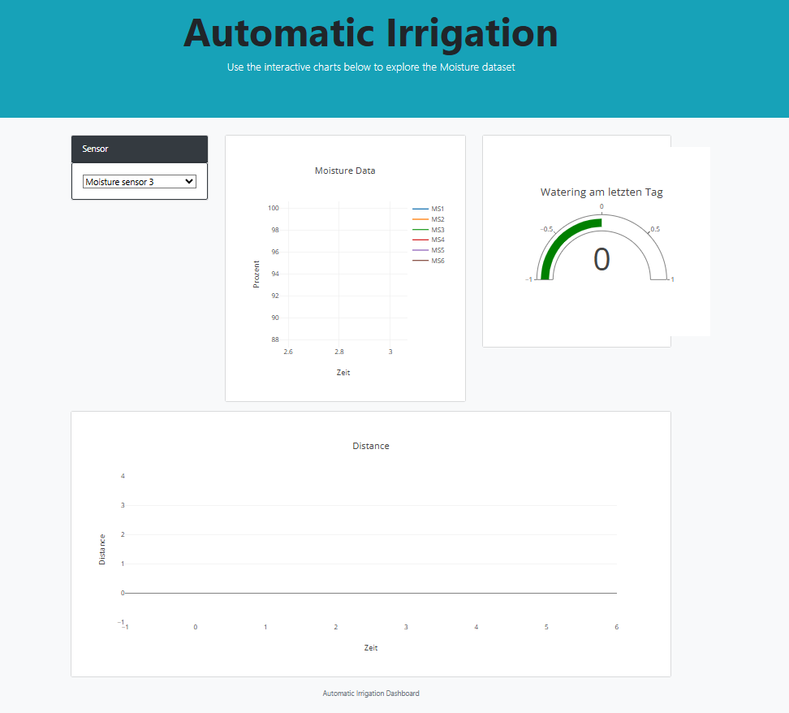
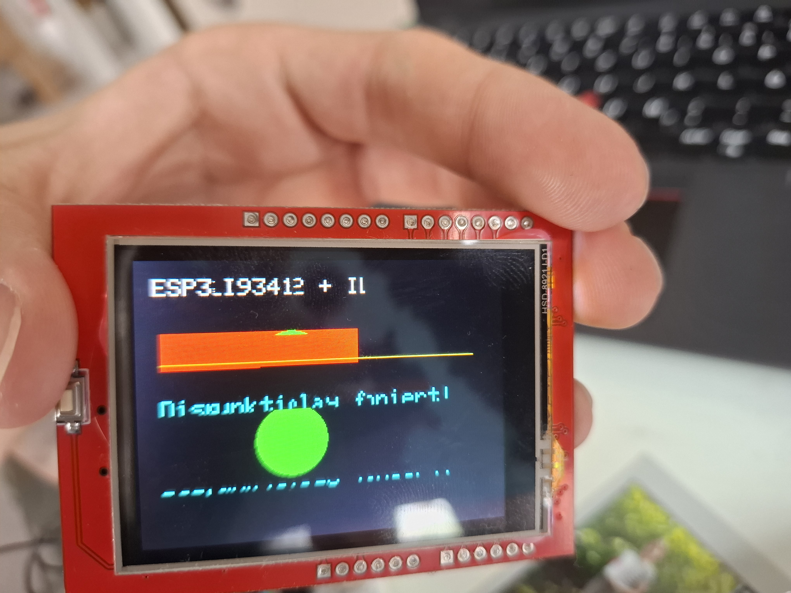
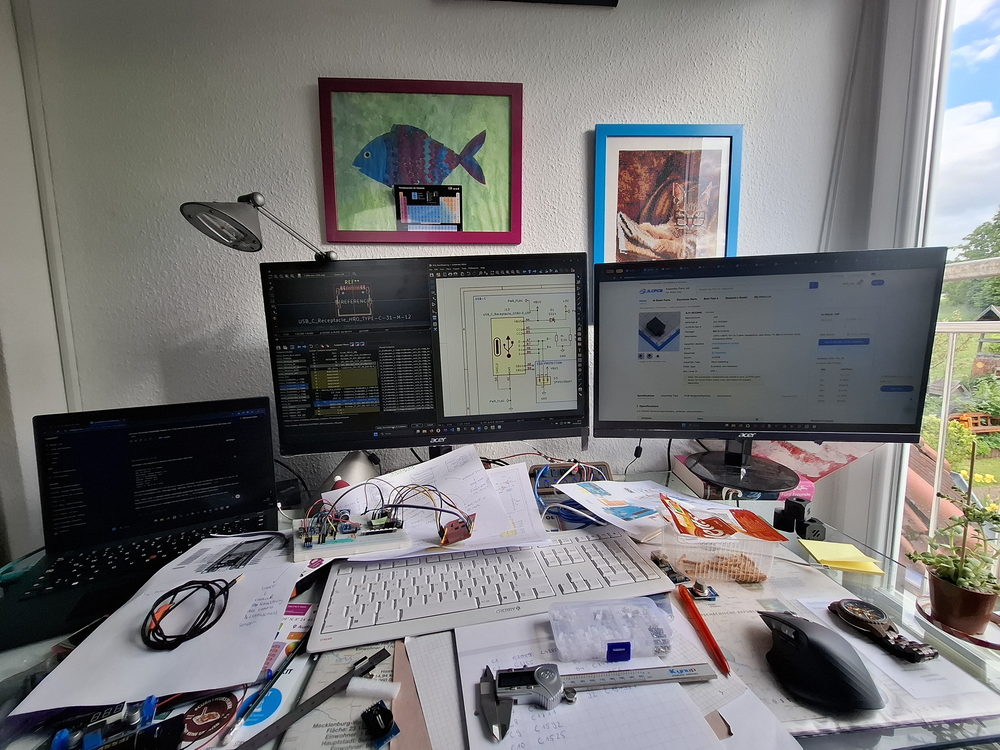
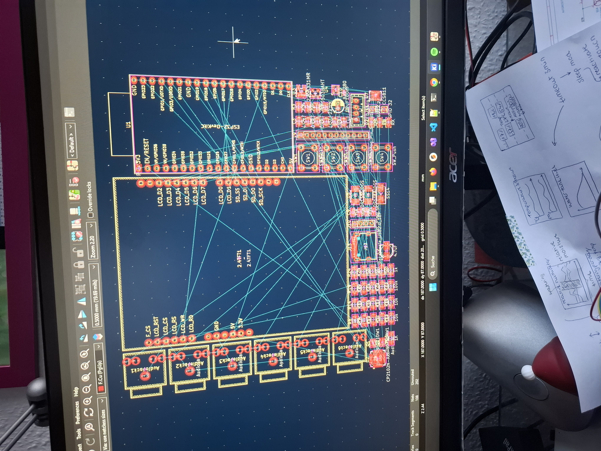
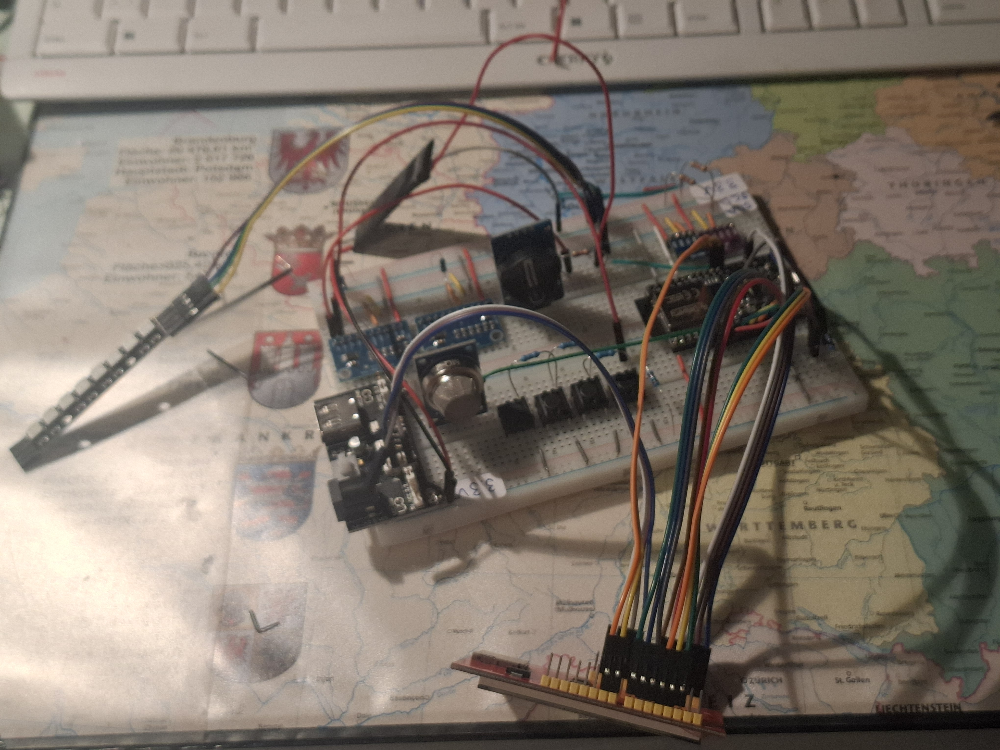
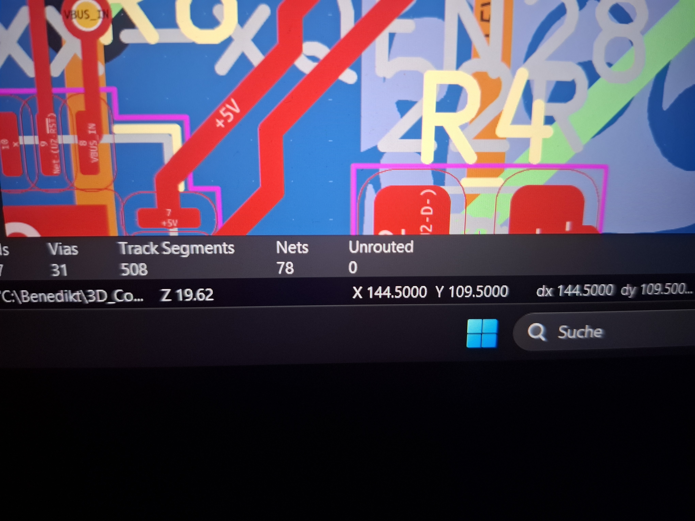

# Journal

## April 2026

I looked for possible solutions for my idea of a smart irrigation system and searched for existing repositories. However, nothing really fitted my needs, so I decided to build my own system.

I researched the required hardware and learned how capacitive soil moisture sensors work. I also started thinking about how the system could monitor several plants individually and how the data could later be used for automatic watering.

**Time spent:** \~5 h

\---

## End of April 2026

I ordered my first soil moisture sensors and tried to monitor soil moisture with an ESP32 DevKitC. I had some issues when using Wi-Fi and analog readings at the same time on the ESP32. I had to figure out which analog pins were still available while Wi-Fi was enabled and which six pins I could use for the sensors.

I coded the first basic working version of the system and designed a simple but good-looking web interface. For that, I had to revise my HTML skills, which were not very strong at that point. I also had to decide which file format I wanted to use for the database. I chose `.csv` because it is much more lightweight than SQL or JSON databases. I had also worked with `.csv` files before, so it was easier for me to get started and modify them using C++ on the ESP32.

I could not find a good existing library or code example that fitted my use case, so I had to code the CSV logging functionality from scratch.

↑ Images of the first conceptional breadboard setup

↑ this was the first data set I catured with the sensors and is captured as a `.csv` file

↑ Screenshot of the code. Look at full code [here](images/Progress/main_cpp_old.pdf)

↑ first WebInteface (already working!!!)

**Time spent:** \~8 h

\---

## Beginning of May 2026

I decided to add a display as an addition to the web interface and ordered a 2.4" TFT LCD screen with resistive touch. However, the display I ordered was especially designed for an Arduino Uno R3 or compatible boards.

Because of that, I had to decide whether I should order a different display, connect the display directly to the ESP32 with wires and lose many of its GPIOs, or connect the Arduino to the ESP32 using some kind of communication protocol.

I researched different kinds of buses and the capabilities of the built-in chip of the Arduino Uno. I came to the conclusion that no bus would be really suitable for transferring a decent amount of display data reliably and fast enough with the Arduino Uno. The Arduino processor would also be too weak for processing diagrams smoothly. Therefore, the diagrams would have to be processed on the ESP32 before being transferred, which would make the system unnecessarily complicated.

In the end, I decided to wire the display directly to the ESP32 and accept the reduced number of free GPIOs.

↑ First Image on Display. There were still errors like you can see :(

**Time spent:** \~6 h
This included trial and error, research and consideration of different possible solutions.

\---

## May 2026 until begin of June 2026

At this point, I first had to clearly define the goals of the project because I kept getting more and more ideas. I considered adding a battery, a USB-C connection, many different sensors, a small solar panel and several other useful or less useful ideas.

To organize the project, I drew a concept diagram and wrote down which GPIO pin should be used for which device. This took longer than expected because some ESP32 pins were not actually capable of doing what I wanted to use them for. There was also still a lack of analog input pins, so I found an I2C analog input expander and ordered it for breadboard testing.

Besides the breadboard prototype, I wanted to build the system as a solid PCB. I researched different PCB design programs and chose KiCad as my preferred PCB design software. I had to get used to the basic principles of PCB design, the general PCB design workflow and some unusual traits of KiCad.

This also took much longer than I had expected. By the end of May 2026, I started designing the PCB for the project. During the PCB design process, I realized that the proportions I had imagined did not really fit reality. Because of that, I decided to split the PCB of the main unit into separate PCBs that could be stacked on top of each other.

At first, I designed the boards as 4-layer PCBs because that made routing much easier than on a 2-layer PCB and I did not have to worry as much about component orientation and trace routing. Later, I changed the design to a 2-layer PCB because it is much cheaper to manufacture.

In addition, I decided to use JLCPCB for PCB manufacturing and researched suitable components. This was quite complex for me because I had not worked much with the specific features of PCB components before. Until then, I had mostly used breadboard modules, through-hole resistors, capacitors, diodes and single-wire- or analog-sensors.

By the end of May, I had created the first PCB design. However, I realized that manufacturing both boards would be much too expensive, around 250 €, so I decided to focus more on the code for a while and postpone the hardware order.

This whole process of getting used to PCB design software, making first attempts, failing, fixing problems and finally achieving some progress took a long time. I did not track the time exactly, but it must have taken much more than 20 hours.

↑ My KiCAD designing setup :)

↑ First time switching to PCB workbench with this project in KiCAD

**Time spent:** >20 h

\---

## June 2026

After the disappointment with the first PCB design, I focused more on the code for the project. I mounted the modules on a breadboard and tested the wiring of the components. During testing, I found some errors in my wiring configuration. I fixed these issues and tested almost every part of the board.

The display was still much more complicated than the other parts. I also had to revise different bus types in order to understand the communication of the 8-bit display, the I2C sensors and the SPI SD shield.

In addition, I ran into some issues with the analog button wiring, so I had to test different kinds of pull-up resistors until it finally worked.

I modified the schematic of the PCB according to these changes and also completely redesigned the PCB layout as a two-layer board (I actually had to do it twice because I forgot to save my changes). This should save about 100 € in manufacturing costs compared to the previous design.

↑ The breadboard looked like this from that on

↑ Another photo of me editing something in KiCAD

Time spent: ~12 h

---

## June 30, 2026

I worked on the screensaver feature. For this, I downloaded a short TikTok video as an `.mp4` file and converted it into a `.gif` file using an online converter. I was then able to process this file with a desktop program and convert it into an `.mjpeg` file, which could be read by the ESP32.

I had to do a lot of research to find a suitable system for decoding and playing a video from an SD card on the ESP32. After several tests and adjustments, the lizard video now looks amazing and is exactly what I was looking for. Additionally, everything is already prepared for implementing screensaver interrupts later.

[LizardVideo](images/Progress/20260630_183828.mp4)
↑ I got it!

**Time spent:** ~5 h

