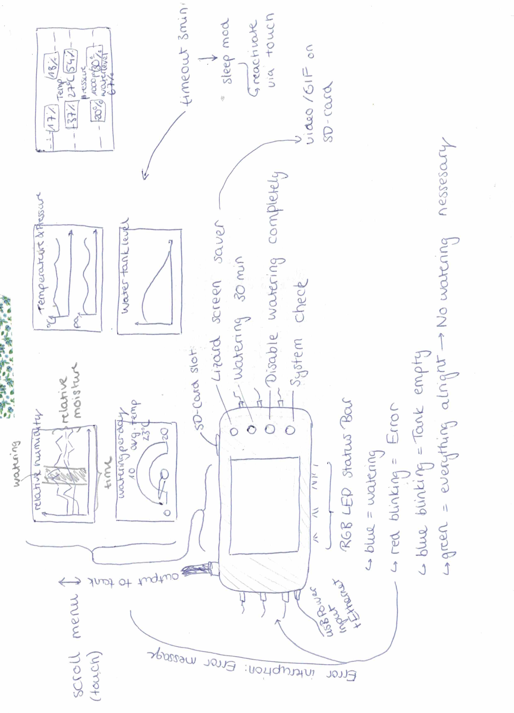
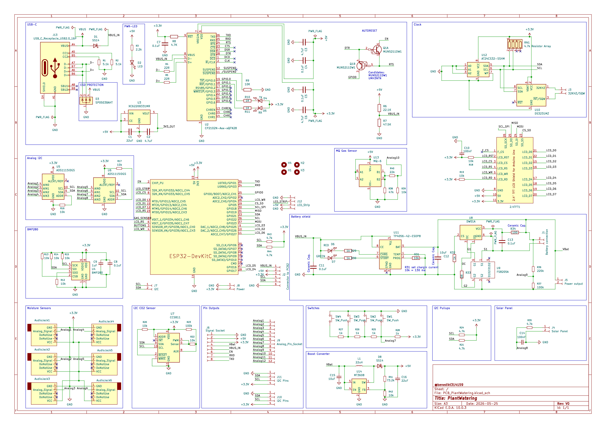
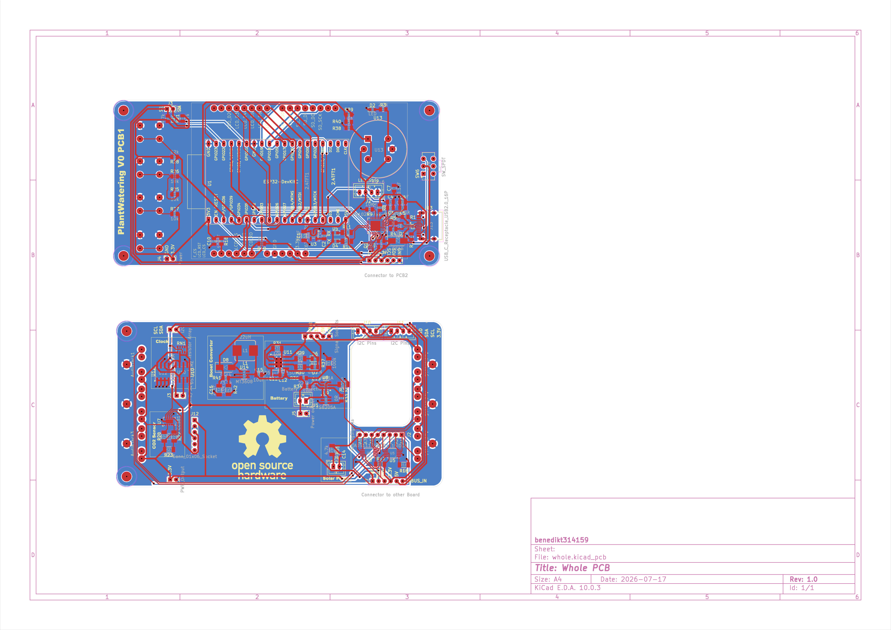
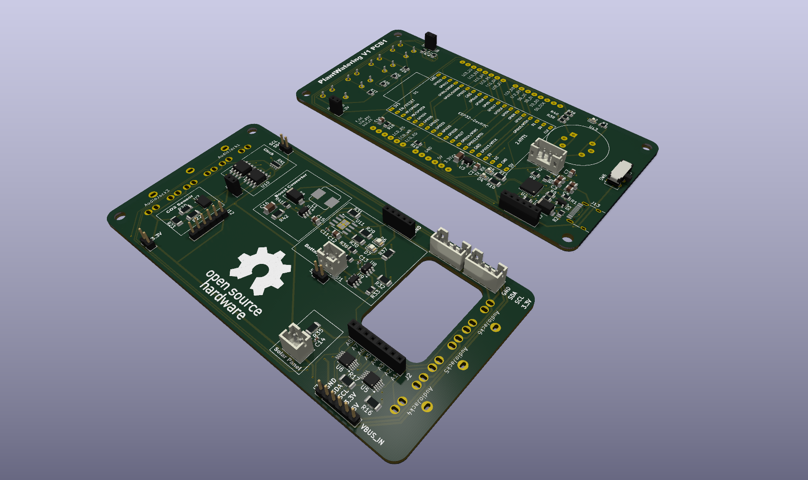

[](https://kicanvas.org/?github=https://github.com/Benedikt3141/Smart-Irrigation-System/tree/development/pcb)

# Smart Irrigation System

The Smart Irrigation System is a battery-powered monitoring and control system for watering up to six individual plants.
Each plant is monitored by a capacitive soil moisture sensor connected to the main control unit.

The project currently focuses on the main monitoring and control unit. A separate watering unit is planned but not fully designed yet. Communication between both units is intended to use ESP-NOW.



## Repository Structure

This repository contains both the firmware and the PCB design files.

- `/firmware/` contains the PlatformIO firmware project.
- `/firmware/src/` contains the ESP32 source code.
- `/src/pcb/` contains the KiCad PCB design files.
- `/src/pcb/gerbers/` contains the exported Gerber files for manufacturing.
- `/src/` contains the KiCad source files required for the Grounded PCB grant submission.

The main monitoring and control unit consists of two stacked custom PCBs. Both PCBs are part of the same project and are required for the complete device.

## File Structure!

```
Smart-Irrigation-System/
│
├── .gitignore
├── Concept.jpg
├── JOURNAL.md
├── README.md
├── gerber01.zip
├── gerber02.zip
└── schematic.pdf
│
├── firmware/
│   │
│   ├── .vscode/
│   ├── include/
│   ├── lib/
│   ├── test/
│   ├── .gitignore
│   ├── platformio.ini
│   │
│   └── src/
│       ├── BMP280.cpp
│       ├── Buttons.h
│       ├── Display.cpp
│       ├── LEDs.cpp
│       ├── MoistureSensors.cpp
│       ├── RTC.cpp
│       ├── SD_Card.cpp
│       ├── Screensaver.cpp
│       ├── Solarpanel.cpp
│       ├── code_concept.txt
│       ├── functions.h
│       ├── main.cpp
│       ├── pindefinitions.h
│       └── scan_I2C_Addresses.cpp
│
├── images/
│   │
│   ├── Lizard/
│   │   └── [...]
│   │
│   └── Progress/
│       ├── 20260413_204009.jpg
│       ├── 20260416_212346.jpg
│       ├── 20260419_100718.jpg
│       ├── 20260520_182432.jpg
│       ├── 20260520_210820.jpg
│       ├── 20260528_220145.jpg
│       ├── 20260605_221754.jpg
│       ├── 20260612_181839.jpg
│       ├── 20260630_183828.mp4
│       ├── ScreenshotCode.png
│       ├── ScreenshotWebInterface.png
│       └── main_cpp_old.pdf
│
└── src/
    └── pcb/
        │
        ├── PCB_PlantWatering/           ← ALTER GESAMTENTWURF
        │   └── [...]
        │
        ├── PlantWatering_PCB01/
        │   │
        │   ├── PlantWatering_PCB01-backups/
        │   ├── production/
        │   │   └── [...]
        │   │
        │   ├── LCD_TFT_Shield.bak
        │   ├── LCD_TFT_Shield.kicad_sym
        │   ├── PlantWatering_PCB01.csv
        │   ├── PlantWatering_PCB01.kicad_pcb
        │   ├── PlantWatering_PCB01.kicad_prl
        │   ├── PlantWatering_PCB01.kicad_pro
        │   ├── PlantWatering_PCB01.kicad_sch
        │   ├── PlantWatering_PCB01.wrl
        │   ├── fabrication-toolkit-options.json
        │   └── schematic01.pdf
        │
        ├── PlantWatering_PCB02/
        │   │
        │   ├── PlantWatering_PCB02-backups/
        │   ├── production/
        │   │   └── [...]
        │   │
        │   ├── PlantWatering_PCB02.kicad_pcb
        │   ├── PlantWatering_PCB02.kicad_prl
        │   ├── PlantWatering_PCB02.kicad_pro
        │   ├── PlantWatering_PCB02.kicad_sch
        │   ├── PlantWatering_PCB02.wrl
        │   ├── _autosave-PlantWatering_PCB02.kicad_sch
        │   ├── fabrication-toolkit-options.json
        │   ├── schematic02.pdf
        │   ├── ~PlantWatering_PCB02.kicad_pro.lck
        │   └── ~PlantWatering_PCB02.kicad_sch.lck
        │
        ├── gerbers/
        │   │
        │   ├── PCB01/
        │   │   ├── PlantWatering_PCB01_V1.zip
        │   │   ├── bom.csv
        │   │   ├── designators.csv
        │   │   ├── netlist.ipc
        │   │   └── positions.csv
        │   │
        │   └── PCB02/
        │       ├── PlantWatering_PCB02.zip
        │       ├── bom.csv
        │       ├── designators.csv
        │       ├── netlist.ipc
        │       └── positions.csv
        │
        ├── PCB_PlantWatering.png
        ├── ProjectSchematic.jpeg
        ├── ProjectSchematic.pdf
        ├── Project_PCB_Layout.jpeg
        └── Project_PCB_Layout.pdf
```

## Project Overview

The system consists of two main parts:

### Main Monitoring and Control Unit

The main unit collects sensor data, displays current measurements on a TFT screen, logs data to an SD card and indicates the system status using an LED strip.

Each soil moisture sensor is connected individually using an audio jack connector.

### Watering Unit

The watering unit is planned as a separate module. It will receive commands from the main control unit via ESP-NOW and control the water flow using a solenoid valve.
The unit should also monitor the water tank level using an ultrasonic sensor.

This part of the system is still work in progress.

## Feature overview

###### Sensors (Inputs)

* \[x] **Soil mositure monitoring** for individual plants
* \[x] **Temperature**
* \[x] Humidity
* \[x] Air pressure
* \[x] Air Quality
* \[x] CO2 concentration
* \[x] Solar intensity
* \[x] 4 Buttons
* \[ ] Tank fill state sensor

###### Other features and outputs

* \[x] **Battery powered**
* \[x] 2.4" TFT LCD Screen with resistive touch
* \[x] SD log with data saved as .csv
* \[x] LED-Strip status indicator
* \[ ] magnetic valve for watering Control
* \[ ] web interface
* \[ ] Push Emails when water is empty/error etc.







## Getting started

#### Requirements

To work with this project, you need:

* VS Code
* PlatformIO or pioarduino IDE Extension
* C++ Compiler
* KiCad 10.0.1 or later

#### Installation

Use git to clone this repository into your computer.

```
git clone https://github.com/Benedikt3141/Smart-Irrigation-System.git
```

Open the project folder in VS Code and build/upload the firmware using PlatformIO or pioarduino.

###### Hardware

You can either use the provided Gerber files or modify the KiCad project and generate new manufacturing files for your preferred PCB supplier.

You can find the gerberfiles [here (PCB01)](src/pcb/PlantWatering_PCB01/production) and [here (PCB02)](src/pcb/PlantWatering_PCB02/production)) or in the project root. The correlating `BOM.csv` and `position.csv` can be found in the same directories.

## License

[MIT](https://choosealicense.com/licenses/mit/)

## Current Project Status

This project is still in development.

The main monitoring unit is mostly implemented. The watering unit, web interface and notification system are planned but not finished yet.

## Sources

[MQ2 Library](https://github.com/labay11/MQ-2-sensor-library/)
[SD Card](https://RandomNerdTutorials.com/esp32-web-server-microsd-card/)

## AI Usage

I only used AI for debugging, spelling correction and research.
Most of the code was written by myself. Since this is a work in progress, the code may still contain bugs or parts that could be improved.

